# About me

Senior Engineer and generalist with over a decade of web engineering experience, specializing in Site Reliability, Observability, and DevOps—designing resilient distributed systems, building automation and quality pipelines, and driving risk-based, pragmatic engineering decisions that balance reliability, security, and business value.

## Skillset overview

```mermaid
mindmap
  root((Sebastian Neubert))
    Site Reliability + DevOps
      Reliability Engineering
        SLIs / SLOs / SLAs
        Error Budgets
        Incident Response
        Postmortems
        Production Readiness Reviews
      Observability
        Metrics
        Logging
        Distributed Tracing
        Prometheus
        Grafana
        Loki
        Alerting Strategies
        Monitoring Dashboards
      Cloud + Infrastructure
        AWS
        Infrastructure as Code
          Terraform
        Kubernetes
        GitOps
        Container Orchestration
        Microservices Architecture
        REST APIs
        GraphQL
        Server-side Ad Insertion
      Security + Compliance
        Security Audits
        Dependency Scanning
        License Scanning
        Compliance Pipelines
        Risk Workshops

    Technical Skills
      Web Development
        PHP (10+ years)
        JavaScript/TypeScript (5+ years)
        Python
        Shell/Bash
        Solidity
        Go (learning mindset)
        Symfony
        Zend Framework
        TYPO3
      Architecture
        Distributed Systems
        Event-driven Systems
        API-driven Systems
        Blockchain FinTech
        Web2 ↔ Web3 Integration
      Testing Tools
        Cypress.io
        Codeception (Core Contributor)
        PHPUnit (8+ years)
        Jest/Vitest
        Postman (5+ years)
        JMeter
      Automation + CI/CD
        GitLab CI
        GitHub Actions
        Jenkins
        Docker
        AWS Lambda
        Pipeline Optimization
        Parallelization Strategies
        Quality Gates
      Databases
        SQL
          MySQL
          MariaDB
          PostgreSQL
        NoSQL
          MongoDB
          Redis
        Streaming
          Kafka

    Quality Engineering
      End-to-End Testing
      Functional Testing
      Integration Testing
      Performance + Load Testing
      Security Testing
      Risk-based Testing
      Lean Testing Approaches
      Test Strategy Consulting
      Test Environment Engineering
      Automation Framework Design
      Exploratory Testing Workshops

    Agile + Leadership
      Agile Scrum
      Agile Transformation
      Cross-functional Collaboration
      Technical Mentoring
      Team Leadership (2+ reports)
      Release Management
      Moderation + Retrospectives
      Stakeholder Communication
      Quality Advocacy

    Soft Skills
      Reliability Mindset
      Systems Thinking
      Detail-Oriented
      Problem-Solving
      Risk-based Decision Making
      Pragmatism
      Curiosity
      Innovation
      Ownership
      Calm in Incidents

    Certifications
      ISTQB Certified Tester
        Foundation Level
        Advanced Level - Technical Test Analyst
      ITIL v3 FOUNDATION
```



## Location - full remote

📬 You have a good change to meet me in this area:

```geojson
{
  "type": "FeatureCollection",
  "features": [
    {
      "type": "Feature",
      "properties": {},
      "geometry": {
        "coordinates": [
          [
            [
              12.878264540163798,
              52.750380652074
            ],
            [
              12.782247604972383,
              52.622333435147084
            ],
            [
              12.484595105877673,
              52.552331178890256
            ],
            [
              12.791849298491371,
              52.08868762788501
            ],
            [
              13.617594941136673,
              52.294698743229446
            ],
            [
              13.790425424481526,
              52.651468048249484
            ],
            [
              13.598391554098725,
              52.81426352047552
            ],
            [
              12.878264540163798,
              52.750380652074
            ]
          ]
        ],
        "type": "Polygon"
      }
    }
  ]
}
```
